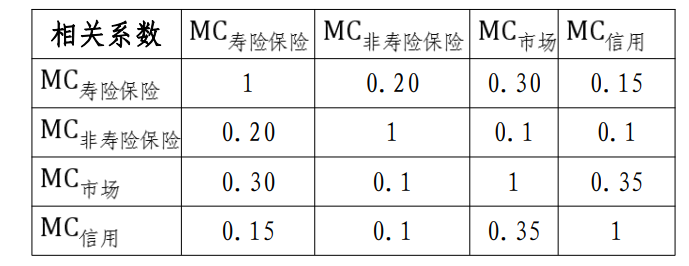
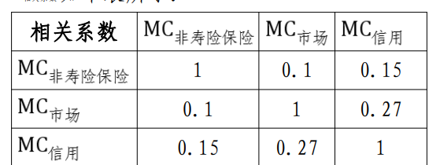
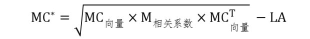
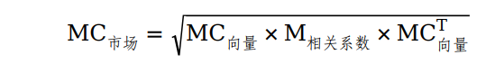

### 《保险公司偿付能力监管规则（Ⅱ）》

《保险公司偿付能力监管规则（Ⅱ）》在2015年颁布的偿付能力监管规则基础上新增了市场风险和信用风险的穿透计量、资本规划以及劳合社（中国），由原来的17项监管规则增至20项。

#### 第一支柱：定量资本要求

##### 实际资本评估

实际资本等于认可资产减去认可负债后的余额

账面价值，包括资产的账面价值和负债的账面价值。资产的账面价值是指保险公司根据企业会计准则确认、计量的资产账面余额扣除资产减值、摊销或折旧后的金额；负债的账面价值是指根据企业会计准则确认、计量的负债账面余额。

- 资本分级
  - 核心资本：持续经营状态下和破产清算状态下均可以吸收损失的资本
  - 附属资本：指在破产清算状态下可以吸收损失的资本

##### 最低资本计量

- 偿付能力风险
  - 固有风险
    - 可资本化风险包括保险风险、市场风险和信用风险
    - 难以资本化风险包括操作风险、战略风险、声誉风险和流动性风险
  - 控制风险
- 最低资本组成
  - 可资本化风险最低资本，即保险风险、市场风险、信用风险对应的最低资本
  - 控制风险最低资本，即控制风险对应的最低资本
  - 附加资本，包括逆周期附加资本、系统重
  - 要性保险机构的附加资本以及其他附加资本
  - 保险风险，是指由于赔付水平、费用水平等的实际经验与预期发生不利偏离，导致保险公司遭受非预期损失的风险
- 计量方法
  - 寿险

    
  - 财险

    
  - 计算公式

    
- 市场风险和信用风险的穿透计量
  - 基础资产
  - 非基础资产
  - 无法穿透：无法识别底层资产及持有份额
  - 市场风险最低资本
    - 市场风险：保险公司的市场风险包括利率风险、权益
      价格风险、房地产价格风险、境外资产价格风险、汇
      率风险和集中度风险
    - 集中度风险
    - 市场风险汇总

      

##### 第二支柱：定性资本计量

- 流动性风险
  - 监管指标
    - 流动性覆盖率
    - 经营活动净现金流回溯不利偏差率
    - 净现金流
  - 现金流测试：基本情景和压力情景下未来一年内的现金流情况
