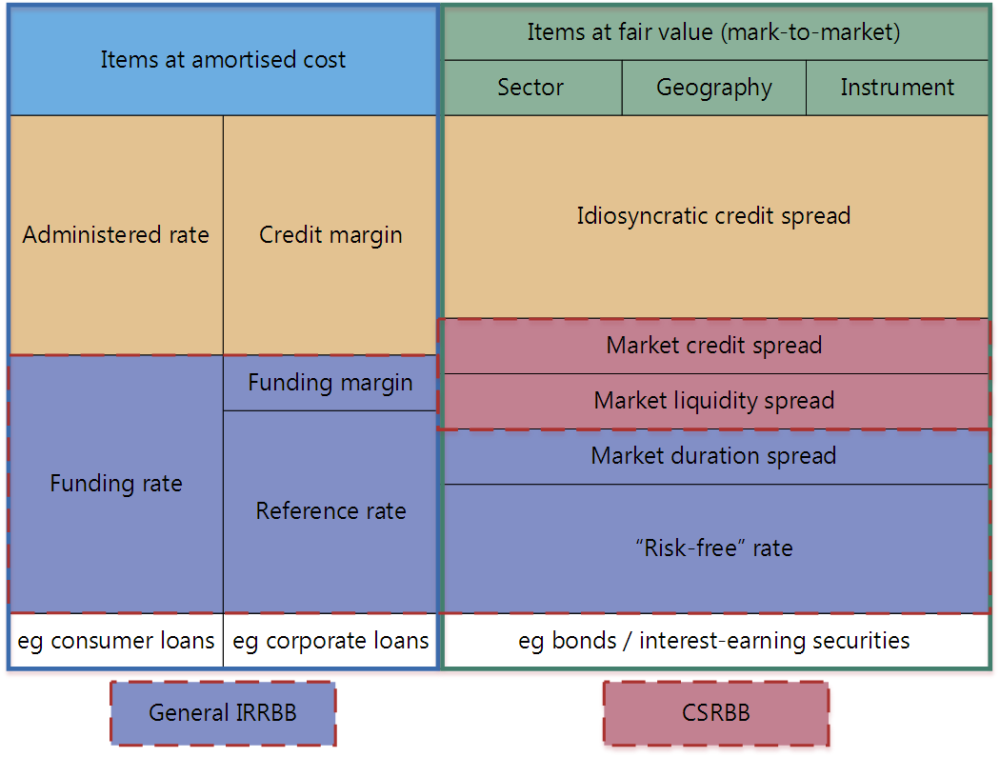

### 巴塞尔协议框架

#### 巴塞尔协议I——1988

非预期损失 = VaR_99% - EL（期望损失水平）

资本充足率 = 资本 / （RWA_信用 + RWA_操作 + RWA_市场）

RWA = EAD（敞口余额）* RW（风险权重）

分子：资本构成

- 一级资本

  - 核心一级资本：普通股、可转债权益部分
  - 其他一级资本：优先股、永续债
- 二级资本

  - 二级资本债、符合条件的次级债

分母：风险加权资本

|          | 信用风险 | 操作风险           | 市场风险   |  |
| -------- | -------- | ------------------ | ---------- | - |
| 初级方法 | 权重法   | 基本指标法         | 标准法     |  |
| 高级方法 | 内评法   | 标准法 高级法 | 内部模型法 |  |

#### 范围和定义

#### 资本的定义

- 一级资本
  - 核心一级资本：普通股、可转债权益部分
  - 其他一级资本：优先股、永续债
- 二级资本
  - 二级资本债、符合条件的次级债

#### 基于风险的资本的要求

巴塞尔框架描述了如何计算信用风险、市场风险和操作风险的RWA

交易账簿中包括金融工具、外汇工具或商品

银行账簿：

(1)非上市股票;

(2)指定用于证券化仓储的工具;

(3)不动产持有量，在将工具分配给交易账簿的背景下，不动产持有量仅涉及不动产的直接持有以及直接持有的衍生品;

(4)零售和中小企业（SME）信贷;

(5)基金的股权投资，除非银行满足以下至少一项条件：

    （一）本行能够全面查看基金的各个组成部分，并经独立第三方核实，向本行提供关于基金构成的充分和经常的信息;或

    （二）银行获得基金的每日报价，并可查阅基金任务规定或有关此类投资基金的国家条例中所载的信息;

(6)对冲基金;

(7)衍生工具和以上述工具类型作为相关资产的基金;或

(8)为对冲上述工具类型的头寸的特定风险而持有的工具。

#### 计算信用风险加权资产RWA

银行可以在两种广泛的方法之间进行选择，以计算其基于风险的信用风险资本要求，包括标准法、内部评级法

##### 标准化方法

度量单独个体的信用风险的标准化方法

- 风险敞口与风险权重

标准化方法为[CRE20](https://www.bis.org/basel_framework/chapter/CRE/20.htm?inforce=20230101&published=20221208)中所述的风险敞口分配标准化风险权重。风险加权资产计算为标准化风险权重与敞口金额的乘积。风险敞口应按风险加权计算，减去具体准备金（包括部分注销）

- 对主权国家的敞口
- 非中央政府公告部门实体的（PSE）的风险敞口
- 对对边开发银行（MDB）的风险敞口
- 对银行的风险敞口（包括贷款、优先债务工具）：分为基本风险权重、短期风险敞口的风险权重
  - 外评法确定风险权重
  - 标准法（分A\B\C级）
- 担保债券的风险敞口（由银行或抵押贷款机构发行的债券）
- 对证券公司和其他金融机构的风险敞口（等同于银行）
- 对企业的风险敞口
  - 一般企业
  - 专业贷款
    - 与房地产无关
    - 专门为融资或者运营实体资产二创建的实体
    - 借款实体无重大资产活动，偿还债务的主要来源是资产产生的收入，而不是借款实体的独立能力
- 次级债务、股权和其他资本工具
  - 股票风险
    - 一级资本结构类似的工具
    - 体现发行人义务且满足1）可无线推迟债务期限2）可选择以股本股份结算债务
  - 股权持有风险
    - 投机性非上市股票敞口400%、其他250%
- 零售敞口类
  - 产品标准
    - 循环信贷、个人定期贷款和租赁（分期贷款、个人理财等）
    - 单个交易对手风险敞口低
- 房地产敞口类
  - TVL是贷款金额除以房产价值

##### IRB法

IRB基于意外损失UL和预期损失。

风险敞口的组成本分包括：违约概率PD、违约损失率LGD、违约风险敞口EAD、有效期限M

银行提供自己的PD估计，并依赖于其他风险组成部分的监管估计。在先进方法（A-IRB方法）下，银行提供自己的PD，LGD和EAD估计，以及自己的M计算，但须符合最低标准。对于基础方法和高级方法，银行必须始终使用本框架中提供的风险权重函数来得出资本要求。

- 资产类别定义
  - 公司
    - 一般企业
    - 专业贷款SL
      - 项目融资：单个项目的收入视为还款来源和风险敞口的担保
      - 对象融资：收购实物资产（飞机）提供资金，现金流是多方租赁合同
      - 商品融资：结构性短期贷款，为交易所交易商品（原油）的储备融资，风险在于商品销售的收益偿还
      - 创收房地产贷款（商业地产），风险敞口取决于资产产生的现金流
      - 高波动性商业地产贷款：损失波动性更高（即资产相关性更高）
  - 主权：主权国家（央行）、公共实体部门
  - 银行
  - 零售
    - 住房抵押贷款
    - 循环贷款
  - 股权
- 风险权重函数
  - 违约风险敞口的风险加权资产
    - 违约敞口资本要求K = LGD与银行预期损失的最佳估计之前的差值
    - 违约敞口的加权资产金额=K * 12.5 * EAD
  - 非违约（企业、主权和银行）风险敞口的风险加权资产
    - 对特定敞口的PD、LGD、EAD以及在某些情况下的有效期限（M）的估计
    - 违约概率PD
    - 违约损失LGD
      - 基础方法
        - 无抵押担保优先债权 45%
        - 次级债权75%
    - 默认暴露
- 交易对手信用风险：当银行向借款人提供贷款时，信用风险敞口是单方面的。
  - 有些交易会产生双边损失风险
    - 向借款人提供贷款并从借款人那里获得抵押品
    - 从交易对手处借入现金并向交易对手提供抵押品（正回购）
    - 从交易对手处借入证券，并将现金作为抵押品发放给交易对手（逆回购）
    - 与交易对手进行衍生品交易
  - 计算交易对手信用风险敞口
    ------------------------

通常指非CCP清算的风险敞口

- 计算风险加权资产的方法
  - 标准化方法：交易对手信用风险敞口金额将根据交易对手的相关风险权重进行风险加权
  - IRB方法：风险加权资产（RWA）和预期损失金额的EAD
- VaR模型计算证券融资交易（SFT）的EAD
  - 使用99%VaR来计算SFT的交易对手信用风险
  - SFT的最短流动性期限或持有期为5个工作日，对于符合VaR模型方法的其他交易，将保留10个工作日的持有期。
  - 银行将使用前一天的VaR数字

$$
E^{*} = max\{0,[(\sum E-\sum C)+Varoutput_{internal model}]\}
$$

#### 计算市场风险RWA

##### 市场风险定义

市场价格变动引起的损失风险

##### 市场风险类别

- 利率风险
- 信用利差风险（证券化、非证券化）
- 外汇风险
- 股票风险
- 商品风险

##### 计算市场风险加权资产的方法

###### 标准法

标准化方法下市场风险的风险加权资产是通过计算的资本要求乘以12.5来确定的。

- 资本要求：三个组成部分的简单总和
  - **基于敏感性的方法下的资本要求**：汇总三个风险指标（delta，vega和曲率）来计算
    - ***Delta*** ：基于工具对监管 delta 风险因素的敏感性的风险度量
    - **Vega**：一种基于对监管性*Vega*风险因素敏感性的风险测量
    - ***曲率*** ：一种风险度量，用于捕获期权价格变化的增量风险度量未捕获的增量风险。曲率风险基于两种压力情景，涉及对每个监管风险因素的向上冲击和向下冲击。
  - 默认风险资本（DRC）要求：受信用风险影响的工具的违约跳跃风险（突发）
  - 剩余风险附加（RRAO）

###### 内部模型法

- 模型要求：规范一组适当的市场风险因素。风险因素是影响银行交易头寸价值的市场利率和价格
  - 利率风险：（IRRBB）是指由于利率变动对其银行账簿的不利变动的影响而对银行资本及其收益产生的当前或预期风险。

    - 无风险利率：这是利率的基本组成部分，代表投资者在给定期限内期望从无风险投资中获得的理论利率。
    - 市场久期价差：久期较长的工具的价格/估值比久期短的工具更容易受到市场利率变化的影响。为了反映现金流和当前利率环境的不确定性，以及随之而来的价格波动，市场需要溢价或利差高于无风险利率以覆盖久期风险。
    - 市场流动性差价：即使标的工具是无风险的，利率也可能包含溢价，以代表市场对投资的兴趣以及愿意的买家和卖家的存在。
    - 一般市场信用利差：这与特殊信用利差不同，代表市场参与者对给定信用质量所需的信用风险溢价（例如，由AA级实体发行的债务工具必须比无风险替代品产生的额外收益率）。
    - 特殊信用利差：这反映了与个人借款人的信用质量相关的特定信用风险（这也将反映对借款人的部门和地理/货币位置所产生的风险的评估）和信用工具的细节（例如债券还是衍生品）
    - 
  - 外汇风险
  - 股票风险
  - 商品风险
- 回溯测试：将校准为一天持有期的风险价值（VaR）指标与过去12个月内的每个实际损益（APL）和假设损益（HPL）进行比较
  - 基于以 99% 置信水平校准的 VaR 度量
  - 实际或假设损失超过银行模型确定的相应每日VaR指标时，就会发生异常或异常值
- 损益归因测试
- 资本要求计算
  - ES预期短缺

#### 计算操作风险RWA值

由于内部流程、人员和系统不足或失败或外部事件而导致的损失风险。该定义包括法律风险，但不包括战略和声誉风险。

#### 流动性风险

- 流动性覆盖率（LCR）：流动性覆盖率（LCR），以确保银行拥有足够的高质量流动资产（HQLA）来应对持续30个日历日的重大压力情景
  - 在没有财务压力的情况下，比率的价值不低于100%（即HQLA的存量应至少等于总净现金流出）
  - 资产可以很容易地立即转换为现金，而价值损失很小或没有价值损失，则被视为HQLA
    - 低风险
    - 估值确定性
    - 与风险资产的低相关性
- 净稳定资金比率（NSFR）
- 监控指标
  - 合同期限不匹配
  - 资金集中

    - 自每个重要交易对手方的资金负债占总负债的百分比
    - 来自每个重要产品/工具的资金负债占总负债的百分比
    - 按重要货币列出的资产和负债金额清单
  - 未被抵押资产

#### 杠杆率

#### 集中度风险

衡量其对单个交易对手或一组关联交易对手的风险敞口，并限制与其资本相关的大额风险敞口的规模

- 主权风险
- 银行同业拆借
- 基金、证券化和其他具有基础资产的结构
-
